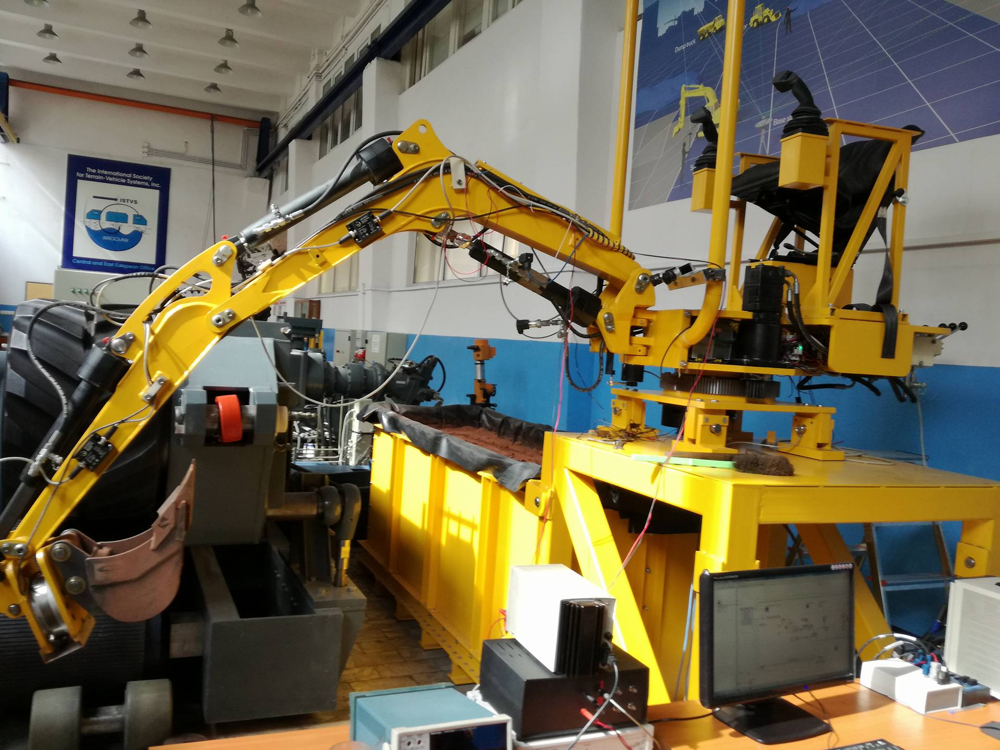
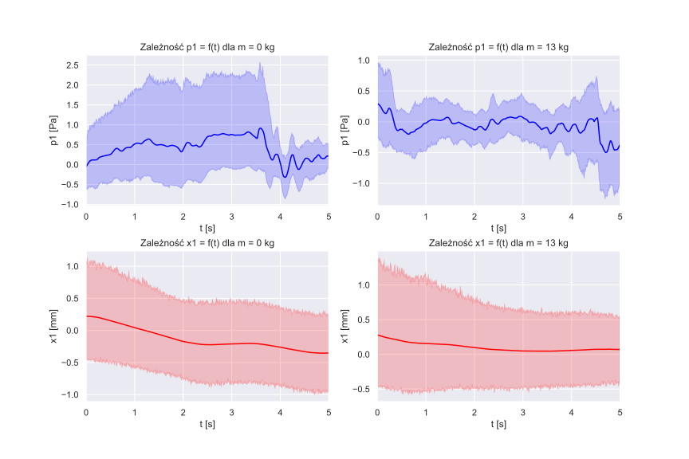
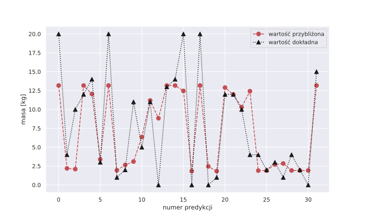

# Neural network-based weighing system
Neural network-based payload determination for moving excavator is a laboratory project based on research on the mini excavator
in the laboratory of the Wrocław University of Science and Technology (PL). 
Project is in the initial phase, requires further improvements based on a larger number of measurements.

This project contains LSTM models created on personally collected dataset (156 measurement sessions), based on sensors connected to mini-excavator.
The regression model predicts weight in the bucket excavator. 
Measurements refers to pressure in the boom cylinder (upper and lower), actuators displacement and hydraulic oil temperature. 

**Measurement stand and test facility:** 

###### Generally there are 6 features: 
  - upper (p1) and lower(p2) pressure in the boom cylinder
  - displacement the boom actuator (x1)
  - displacement the excavator arm (x2)
  - displacement the tool excavator (x3)
  - oil temperature (T)
  
**Example of measurements: averaged pressure signal waveform for a sample mass value with confidence interval**

###### Project contains following files:
1. `lstm_main_data_test` - model trained on basic dataset (without data augmentation or feature selection)
2. `lstm_augmentation_test` - model trained on augmented dataset
3. `lstm_GridSearchCV` - performed GridSearch test
4. `project_utils` - python file contains useful methods: 
  * format_data - function formatting 'original' data in performed dataset
  * prepare_data - reshapes data and make standardization. It returns feature 3D numpy array X and 2D labels array Y
  * augmentation - augments data - There are two methods: 
      1) first, based on scientific work: Ch. Bergmeir, R.J. Hyndman, J. M. Benitez *"Bagging Exponential Smoothing Methods using STL  Decomposition and Box-Cox Transformation"* and assumes use these 3 tools (MBB bootstrap, seasonal decomposition and Yeo-Johnson Transformation) on single timeseries.
      2) second method it's a simple technique: I generate a new sequence based on the noise (from normal distribution) of the original sequence. Standard deviation has been determined separately for each measurement. 

###### Results: Example of mass predictions on the basic (not augmented) dataset 

